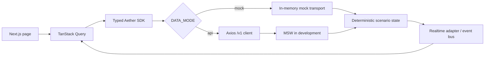

# Aether MVP System Architecture

## 1. Architecture objective

The MVP proves one safe desired-state correction loop while preserving typed
boundaries for later backend and chain integrations. The frontend is complete first
and runs without secrets or network dependencies.

## 2. Workspace

```text
apps/web              Next.js App Router frontend
packages/ui           Aether primitives and composite UI
packages/shared       Browser-safe Zod schemas and inferred types
packages/sdk          Typed browser client and realtime interfaces
packages/mock-data    Deterministic state machine, direct transport, MSW handlers
packages/*-config     Shared TypeScript, lint, formatting, test, Tailwind config
```

Backend, worker, contracts, and provider implementations are post-frontend phases.
Their future boundaries must implement the contracts described here without changing
page components.

## 3. Frontend flow



The direct mock transport prevents service-worker startup races. MSW remains available
to validate the future HTTP boundary. API mode never imports fixtures into components.

## 4. Browser contract

Current endpoints:

- `GET /v1/dashboard?organizationId&protocolId`
- `POST /v1/demo/scenario`
- `POST /v1/demo/advance`
- `POST /v1/operations/:operationId/approval`
- `POST /v1/desired-state/validate`

The dashboard aggregate contains one organization, one protocol, metrics, setup
records, drift, operation, execution, notifications used as contextual updates, audit
events, scenario, lifecycle stage, and realtime status. Every payload is parsed with
browser-safe Zod schemas.

## 5. Future API modules

The later NestJS API should implement only these MVP modules:

- auth and organization context;
- protocol setup;
- desired state versions;
- observations and drift;
- operations and approvals;
- KeeperHub executions;
- audit events;
- realtime event stream;
- typed provider adapters.

Do not recreate standalone incidents, approvals, policies, invariants, integrations,
teams, notification-center, or broad settings modules. Approval and safety checks are
subresources of an operation; provider setup belongs to Protocol Setup.

## 6. Future persistence

Minimum MongoDB collections:

- `organizations`
- `users`
- `memberships`
- `protocols`
- `networks`
- `contracts`
- `provider_connections` with encrypted server-only credentials
- `desired_state_versions`
- `observations`
- `drift_findings`
- `operations`
- `operation_plan_versions`
- `operation_approvals`
- `executions`
- `execution_steps`
- `audit_events`
- `outbox_events`

All protocol-scoped documents include organization and protocol identifiers. Indexes
must cover tenant boundary, status, updated timestamp, external correlation ID, and
idempotency key where applicable.

## 7. Future worker and queues

Minimum BullMQ queues:

- `observation.scan`
- `drift.evaluate`
- `operation.simulate`
- `execution.submit`
- `execution.reconcile`
- `execution.verify`
- `audit.dispatch`

Workers use stable idempotency keys, leases where duplicate work is dangerous,
bounded retries, explicit dead-letter visibility, and an outbox for database-to-event
publication. An unknown transaction outcome always enters reconciliation before any
retry decision.

## 8. Provider adapters

Typed adapters:

- `ChainReader` for block-pinned reads, receipts, logs, and confirmations.
- `Simulator` for exact-request simulation.
- `KeeperHubProvider` for workflows, status, logs, and external correlation.
- `GitHubProvider` for read-only release and pull-request provenance.
- `InvestigationAssistant` for schema-validated summaries only.
- `RealtimePublisher` for SSE events.

Mocks and live providers implement identical interfaces. No provider response is
trusted without runtime validation.

## 9. Authorization and execution safety

Authorization is deterministic and server-side:

1. authenticate actor and resolve tenant;
2. authorize role for protocol and action;
3. bind action to exact operation plan hash;
4. check chain, target, function, calldata, and value limits;
5. evaluate invariants;
6. simulate exact request;
7. collect required unexpired approvals;
8. persist idempotency and provider correlation before retry;
9. submit through KeeperHub;
10. wait for finality and independently verify postconditions.

An LLM never authorizes or signs. Credentials and private keys never enter the browser.

## 10. Realtime

SSE is the MVP live transport. Event envelopes contain event ID, sequence, type,
organization, protocol, resource ID, timestamp, and minimal payload. Clients reconnect
with last event ID, deduplicate by ID, and invalidate scoped Query caches.

Required events:

- `dashboard.updated`
- `drift.detected`
- `operation.updated`
- `execution.updated`
- `audit.recorded`

## 11. Observability

Every mutation carries request, actor, operation, execution, idempotency, and provider
correlation identifiers. Logs are structured and redact credentials and transaction
signing material. Metrics cover scan age, drift count, simulation failures, approval
latency, submission latency, reconciliation duration, and verification failures.

## 12. Deployment modes

- `mock`: browser uses deterministic local transport; no secrets.
- `api`: browser calls `/v1`; server owns credentials and external integrations.

Switching modes must require environment configuration only, not component changes.
